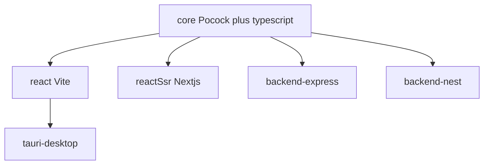

# Подпространства установки + ревью состава

Сохранено из согласованного плана. Каталог в этом репозитории уже собран по нему.

Репозиторий — свой каталог. Pocock даёт **процесс** (ядро в каждом пресете). Vercel — только UI/React/RN: подпространства задаём через `presets.json` + `scripts/install-subspace.mjs` → `npx skills add -a cursor --copy --skill …`.

Claude-формат `SKILL.md` совместим с Cursor; вызовы Skill tool / пути Claude правятся при вендоринге.

## Ядро `core`

`grilling`, `grill-me`, `grill-with-docs`, `domain-modeling`, `to-spec`, `to-tickets`, `tdd`, `implement`, `code-review`, `diagnosing-bugs`, `codebase-design`, `typescript`.

Не в core: `teach`, `wayfinder`, `wizard`, `research`, `improve-codebase-architecture`, Claude-only `misc`. `implement`: коммит только по явной просьбе.

## Подпространства

- **react** (Vite + React + TS): `core` + `vite-react` + composition + web-design-guidelines. Без `vercel-react-best-practices`.
- **react-ssr** = Next.js и его бандлер. `core` + `nextjs` + `vercel-react-best-practices` + composition + guidelines. Не extends `react`.
- **tauri-desktop**: `react` + `tauri`.
- **backend-express**: `core` + `express-api`. БД: `db-postgres`, `db-mongo`.
- **backend-nest**: `core` + `nestjs`.
- **mobile**: `core` + Vercel RN + `expo-rn`.

High-risk Vercel только в `optional/`.

## Риски

Подпространства убирают не установленные скиллы; Cursor всё равно кладёт description установленных (ужаты ~100 символов). Не ставить `react` и `react-ssr` вместе. Pinned SHA. Секреты не печатать. Tauri — минимальный allowlist. Drizzle — review SQL.

## Установка

См. [README.md](../README.md).
